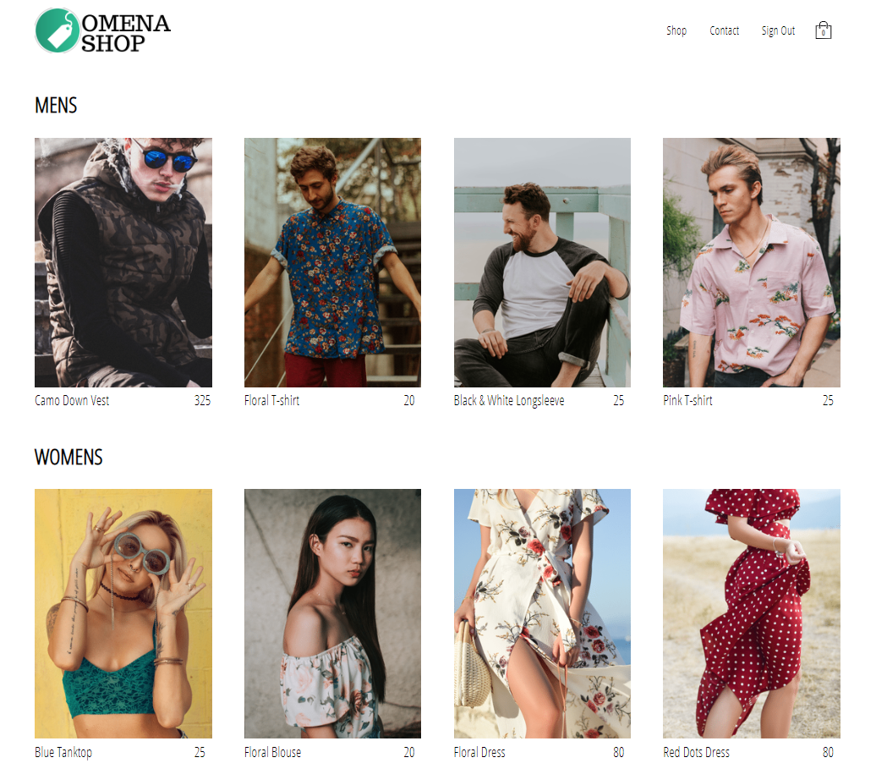

<!-- <h1 align="center">
    
</h1> -->

<h3 align="center">
  Shop Multi Porpouse With Lib Redux
</h3>

<blockquote align="center">“Dreams don't work unless you do”!</blockquote>

## :trophy: About

Here the sytem i used react with class only class not hooks

### :art: Style code

Used to style code, ESLint, Prettier, EditorConfig

### :dart: Result:

A shop with some side effect when you like to add a product to a cart.

### :open_file_folder: Image:

## :memo: License

This Project it a lincense MIT. See the file [LICENSE](LICENSE.md) for more details.

---
